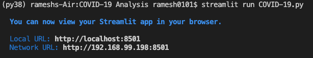

# COVID-19
COVID-19 Data Analysis
Follow these steps to run this application in your local system:
* Clone this repository to your local system
* Install all the dependencies `pip install -r requirements.txt`
* Then run ``streamlit run COVID-19.py``
* You will see this local URL: 

* Copy and paste URL into any browser to see the page.  
## Heroku app
Check out this application in [Heroku app](https://covid19-rakesh.herokuapp.com/)

